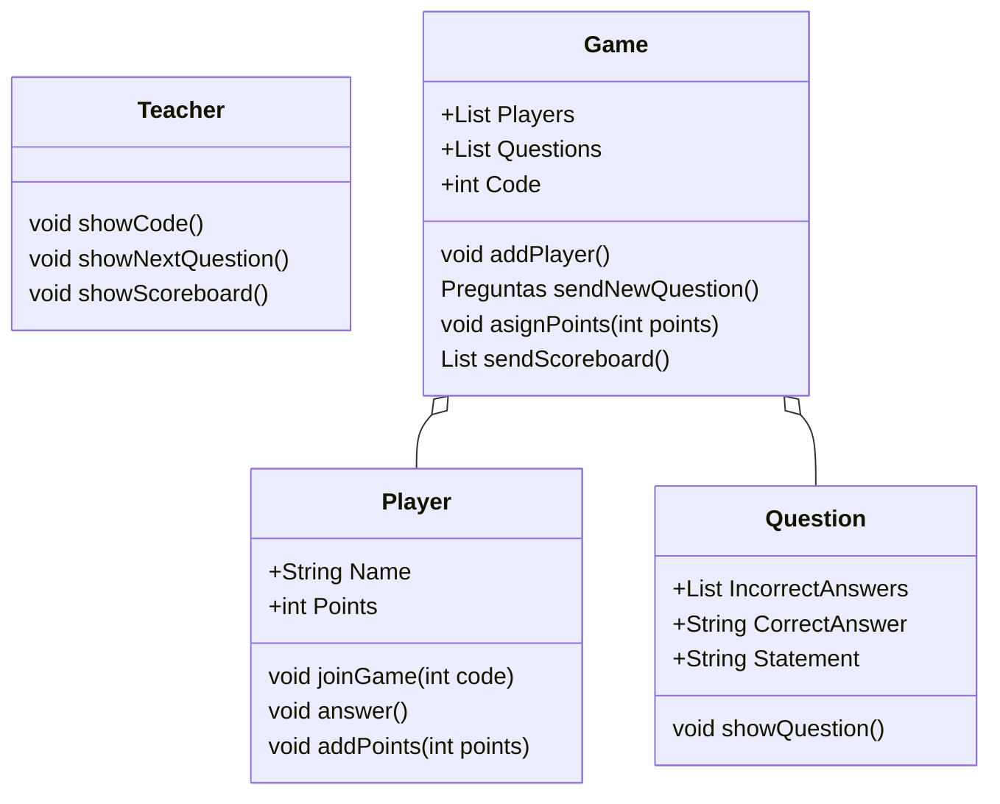

# KahootDiagram

## Class Diagram

## Sequence Diagram

```uml-sequence-diagram
Title: Hello world example
Bob->Alice: Hello
Alice-->Bob: How are you?
Note left of Bob: Bob thinks
Bob->>Alice: I'm good, thanks! How about you?
Alice-->Bob: I'm doing great, thank you!
```

