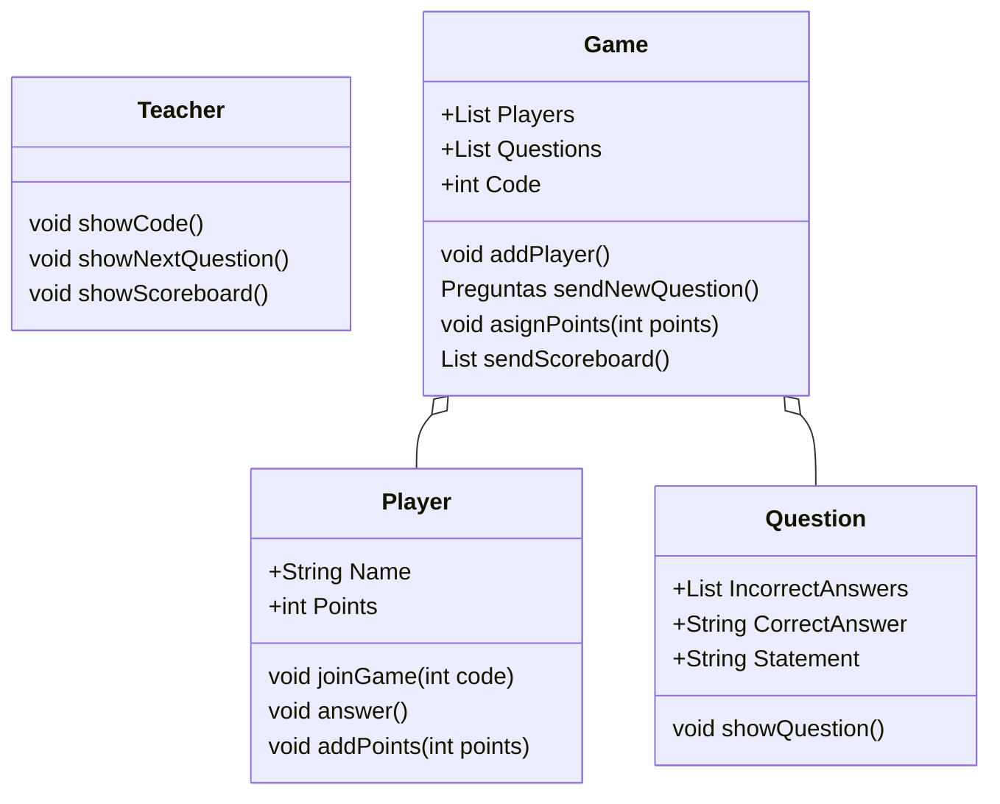

# KahootDiagram

## Class Diagram

## Sequence Diagram

```uml-sequence-diagram
Teacher ->> Game : new Game
Game ->> Teacher : sendCode
Teacher ->> Students : showCode
Students ->> Game : joinGame
Game ->> Teacher : sendQuestion
Teacher ->> Students : showNextQuestion
Students ->> Game : answer
Game ->> Teacher : sendScoreboard
Teacher ->> Students : showNextQuestion
```

